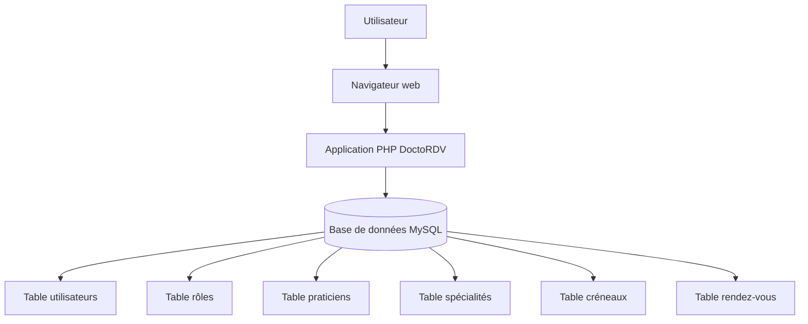

# Architecture prévue — DoctoRDV

## Objectif

Ce document présente l’architecture simple prévue pour l’application DoctoRDV.

## Architecture générale

DoctoRDV sera une application web accessible depuis un navigateur.

Elle sera développée avec :

- PHP ;
- MySQL ;
- HTML / CSS ;
- Bootstrap ;
- JavaScript simple ;
- Laragon pour le développement local.

## Schéma simplifié

## Composants prévus

| Composant | Rôle |
|---|---|
| Navigateur web | Accès à l’application |
| Application PHP | Gestion des pages, formulaires et traitements |
| Base MySQL | Stockage des utilisateurs, praticiens, créneaux et rendez-vous |
| Bootstrap | Mise en forme responsive |
| GitHub | Versionnement du projet et documentation |

## Données principales

Les données principales prévues sont :

- utilisateurs ;
- rôles ;
- praticiens ;
- spécialités ;
- créneaux ;
- rendez-vous.

## Règles importantes

L’application devra éviter :

- la réservation d’un créneau déjà pris ;
- l’accès au planning d’un autre praticien ;
- la modification non autorisée des rendez-vous ;
- les champs obligatoires vides ;
- les erreurs de dates.

## Limites

La première version ne prévoit pas :

- de vraies données médicales ;
- de paiement ;
- de SMS ;
- d’envoi automatique d’email ;
- de synchronisation avec Google Agenda ;
- d’espace médical avancé.

## Justification

Cette architecture est simple, claire et adaptée au niveau BTS SIO SLAM.

Elle permet de présenter une solution applicative complète avec base de données, rôles, formulaires, traitements et documentation.