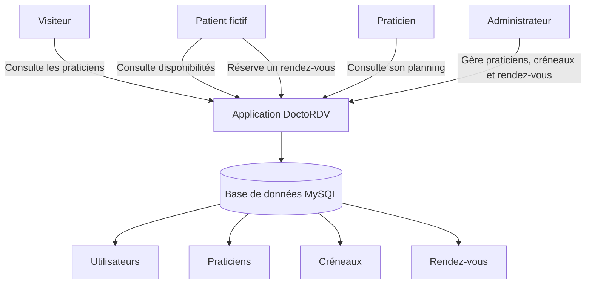

# Architecture et flux — DoctoRDV

## Objectif

Ce document présente les principaux flux d’information dans l’application DoctoRDV.

Il sert à comprendre comment les utilisateurs interagissent avec l’application avant de passer à la conception détaillée.

## Contexte

MediCentre Nova souhaite améliorer la gestion des rendez-vous médicaux fictifs.

Actuellement, les rendez-vous sont principalement gérés par téléphone. L’application DoctoRDV doit permettre de centraliser la consultation des praticiens, les disponibilités et les réservations.

## Flux principaux

| Flux | Départ | Arrivée | Description |
|---|---|---|---|
| Consultation praticien | Visiteur / patient | Application | L’utilisateur consulte la liste des praticiens |
| Consultation disponibilité | Patient | Application | Le patient consulte les créneaux disponibles |
| Réservation | Patient | Base de données | Le rendez-vous est enregistré |
| Consultation planning | Praticien | Application | Le praticien consulte ses rendez-vous |
| Gestion praticiens | Administrateur | Base de données | L’administrateur ajoute ou modifie les praticiens |
| Gestion créneaux | Administrateur | Base de données | L’administrateur crée ou modifie les disponibilités |
| Annulation | Patient / administrateur | Base de données | Un rendez-vous est annulé |

## Schéma simplifié des flux

## Données manipulées

Les principales données manipulées sont :

- utilisateurs ;
- rôles ;
- praticiens ;
- spécialités ;
- créneaux ;
- rendez-vous.

## Problèmes à éviter

L’application devra éviter :

- les doubles réservations ;
- les créneaux sans praticien ;
- les rendez-vous sans patient ;
- les erreurs de saisie ;
- l’accès non autorisé à certaines pages.

## Justification

Cette analyse permet de préparer la future base de données et les règles de gestion.

Elle servira aussi à expliquer au jury la logique de fonctionnement de l’application.