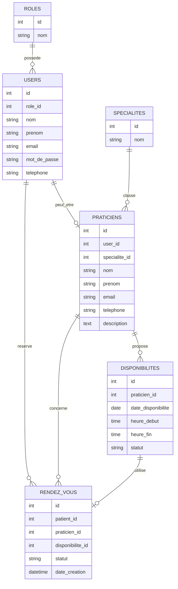

# MCD brouillon — DoctoRDV

## Objectif

Ce document présente un premier modèle conceptuel de données pour l’application DoctoRDV.

Il s’agit d’un brouillon destiné à préparer la future base de données MySQL.

## Entités principales

Les entités principales identifiées sont :

- rôle ;
- utilisateur ;
- spécialité ;
- praticien ;
- disponibilité ;
- rendez-vous.

Dans cette première version, un patient est représenté par un utilisateur ayant le rôle `patient`.

## Diagramme brouillon

## Explication simple

Un utilisateur possède un rôle.

Les rôles prévus sont :

- administrateur ;
- praticien ;
- patient.

Un praticien appartient à une spécialité.

Un praticien peut proposer plusieurs disponibilités.

Un patient peut réserver un rendez-vous sur une disponibilité.

Un rendez-vous est lié à :

- un patient ;
- un praticien ;
- une disponibilité.

## Limite du modèle

Ce modèle reste volontairement simple.

Il ne gère pas encore :

- les notifications ;
- les rappels par SMS ;
- les paiements ;
- les dossiers médicaux ;
- les données médicales sensibles.

Ces éléments ne sont pas nécessaires pour une première version BTS SIO SLAM.