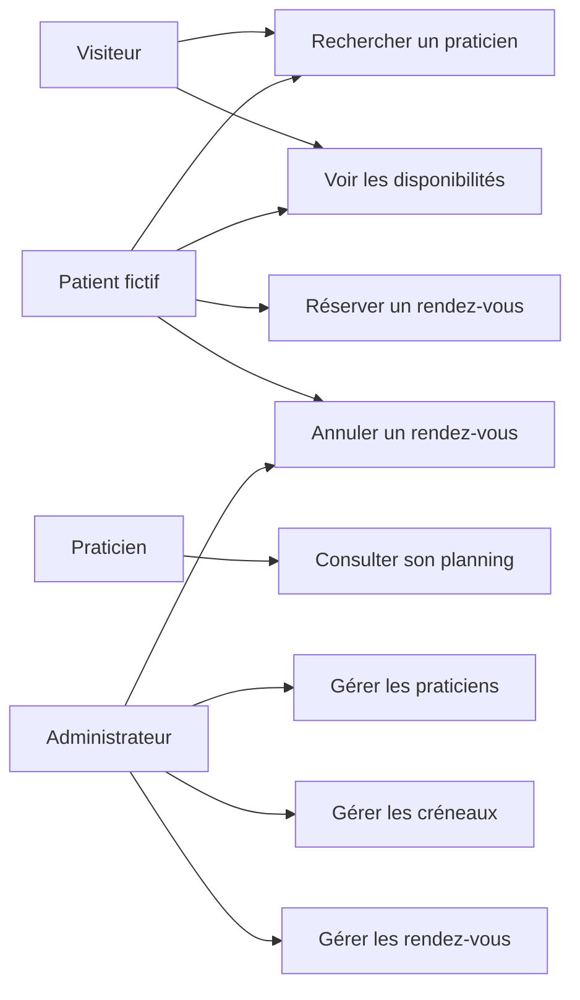

# Diagramme des cas d’utilisation — DoctoRDV

## Objectif

Ce document présente un diagramme simplifié des cas d’utilisation de l’application DoctoRDV.

## Diagramme simplifié

## Lecture du diagramme

Le visiteur peut rechercher un praticien et consulter certaines disponibilités.

Le patient fictif peut rechercher un praticien, voir les disponibilités, réserver et annuler un rendez-vous.

Le praticien peut consulter son planning.

L’administrateur peut gérer les praticiens, les créneaux et les rendez-vous.

## Justification

Le diagramme reste volontairement simple afin de garder un périmètre réaliste pour le BTS SIO SLAM.

## Lien avec E6 SLAM

Ce diagramme prépare la conception fonctionnelle de la solution applicative.